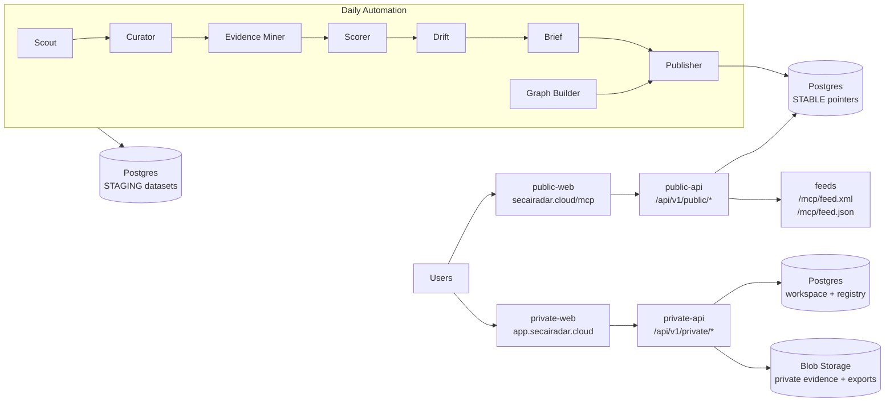

# SecAI Radar — secairadar.cloud Master Services Kickoff (v1.0)
**Date:** 2026-01-23  
**Purpose:** Provide a single, engineering-facing “master services” document that kickstarts development of **secairadar.cloud** (Verified MCP Trust Hub + Private Trust Registry + Daily Automation).  
**Use:** Paste into Cursor/VS Code as the primary architecture context. This doc ties together domains, services, endpoints, data flows, and build sequencing (Steps 1–7).

---

## 1) What we are building (in one paragraph)
**SecAI Radar** becomes a *trusted authority* for MCP security posture by publishing a **public Trust Hub** (rankings, evidence, drift, daily brief, GK explainability) and offering a **private Trust Registry** (workspaces, inventory, policies, approvals, evidence packs, audit exports). A **daily automation pipeline** continuously discovers MCP providers, extracts verifiable evidence, scores posture, detects drift, generates briefs, and publishes updates with atomic dataset swaps.

---

## 2) Domain + routing map (hard boundaries)
### 2.1 Domains
- **Corporate:** `zimax.net` (links only; no runtime dependencies)
- **Public Trust Hub:** `secairadar.cloud`
  - Web routes: `/mcp/*`
  - Public API: `/api/v1/public/*`
  - Feeds: `/mcp/feed.xml`, `/mcp/feed.json`
- **Private Trust Registry:** `app.secairadar.cloud` (login + workspace UI)
  - Calls Private API on `secairadar.cloud/api/v1/private/*`
- **Platform/runtime (later integration):** `ctxeco.com`, `api.ctxeco.com`
- **OSS engine:** GitHub `derekbmoore/openContextGraph` (MIT)

### 2.2 Public vs Private boundary (non-negotiable)
- **Public surfaces** must **never** expose private blob paths, private evidence packs, workspace data, or raw internal artifacts.
- **Private surfaces** require Entra OIDC auth + RBAC, and can expose evidence packs and audit exports to authorized workspace members only.

---

## 3) Service catalog (what runs where)
> Treat each “service” as an independently deployable unit (even if you start as a monorepo).

| Service | Type | Domain | Runtime | Primary responsibility | Talks to |
|---|---|---|---|---|---|
| `public-web` | Web app | secairadar.cloud | Static/SSR | Public Trust Hub UI `/mcp/*` | `public-api` |
| `public-api` | API | secairadar.cloud | Container | Read-only endpoints, caching, redaction | Postgres (stable), cache, feeds |
| `private-web` | Web app | app.secairadar.cloud | Static/SSR | Trust Registry UI | `private-api` |
| `private-api` | API | secairadar.cloud | Container | Auth, RBAC, registry CRUD, uploads, exports | Postgres, Blob (private), Key Vault |
| `workers-scout` | Worker | internal | Job | Ingest provider lists | Postgres (staging) |
| `workers-curator` | Worker | internal | Job | Canonicalize/dedupe providers/servers | Postgres (staging) |
| `workers-evidence` | Worker | internal | Job | Extract evidence + claims from docs/repos | Postgres (staging) |
| `workers-scorer` | Worker | internal | Job | Compute trust scores + tiers + explainability | Postgres (staging) |
| `workers-drift` | Worker | internal | Job | Detect changes, create drift events | Postgres (staging) |
| `workers-brief` | Worker | internal | Job | Generate daily brief (Sage Meridian integration stub) | Postgres (staging) |
| `publisher` | Job | internal | Job | Validate + atomic swap stable pointers + warm caches | Postgres (stable), cache |
| `graph-builder` | Worker | internal | Job | Build GK graph snapshots per server | Postgres (staging) |
| `packages/scoring` | Library | repo | N/A | Trust Score + Evidence Confidence algorithms | used by workers |
| `packages/shared` | Library | repo | N/A | Types + schemas + API envelopes + copy | used everywhere |

---

## 4) High-level architecture diagram (Mermaid)


---

## 5) Data plane (minimum viable)
### 5.1 Storage components
- **Postgres** (single cluster to start; logical separation by schemas/tables)
  - **Public data:** providers, servers, evidence (redacted-safe), claims, score snapshots, drift events, daily briefs, graph snapshots
  - **Private data:** workspaces, members, roles, inventory, policies, approvals, evidence-pack metadata, export metadata, audit logs
  - **Operational:** run logs, job status, caches/pointers
- **Blob Storage**
  - `private-evidence-packs/` (workspace-only access)
  - `private-exports/` (audit pack exports)
- **Optional Search Index** (later): for fast typeahead and faceted search

### 5.2 Publish model (atomic swap)
- Workers write to **STAGING** tables/partitions
- Publisher validates dataset integrity (counts, required fields)
- Publisher flips stable pointers/materialized views to **STABLE**
- Public API reads **only STABLE** plus run status

---

## 6) Public API contract (standard envelope)
### 6.1 Response envelope (mandatory)
Every public endpoint returns:
- `generatedAt`
- `methodologyVersion`
- `data` object
- consistent `error` shape on failure

Example:
```json
{
  "generatedAt": "2026-01-23T00:00:00Z",
  "methodologyVersion": "rubric-v1",
  "data": {},
  "error": null
}
```

### 6.2 Public endpoints (MVP)
- `GET /api/v1/public/health`
- `GET /api/v1/public/mcp/summary?window=24h|7d|30d`
- `GET /api/v1/public/mcp/rankings` (filters + pagination + sorting)
- `GET /api/v1/public/mcp/servers/{idOrSlug}`
- `GET /api/v1/public/mcp/servers/{idOrSlug}/evidence`
- `GET /api/v1/public/mcp/servers/{idOrSlug}/drift?window=90d`
- `GET /api/v1/public/mcp/servers/{idOrSlug}/graph`
- `GET /api/v1/public/mcp/daily/{YYYY-MM-DD}`
- `GET /api/v1/public/status` (last successful run; used for “stale banner”)

**Cross-cutting:** ETag + Cache-Control on summary/rankings/server pages. Redaction middleware on all public responses.

---

## 7) Private API contract (registry)
### 7.1 AuthN/AuthZ
- **Entra OIDC** for user login
- Private API validates JWT and extracts:
  - `userId` (subject)
  - tenant identifiers
- **RBAC middleware** enforces workspace roles:
  - Admin, PolicyApprover, EvidenceValidator, Member, Viewer

### 7.2 Private endpoints (MVP)
- `GET/POST /api/v1/private/registry/servers` (inventory)
- `GET/POST /api/v1/private/registry/policies`
- `POST /policies/{id}/approve|deny`
- `POST /api/v1/private/registry/evidence-packs` (upload → private blob)
- `POST /evidence-packs/{id}/validate`
- `POST /api/v1/private/registry/exports/audit-pack` (JSON export → private blob)
- Audit logging for every registry change

---

## 8) Web UI surfaces (routes)
### 8.1 Public web (secairadar.cloud)
- `/mcp` overview dashboard (KPIs + highlights + movers)
- `/mcp/rankings` faceted filters, sorting, pagination
- `/mcp/servers/{slug}` tabs: Overview, Evidence, Drift, Graph
- `/mcp/daily/{date}` daily brief
- `/mcp/methodology` definitions + disclaimers + versioning
- `/mcp/submit` public evidence submission (stores submission record)

### 8.2 Private web (app.secairadar.cloud)
- `/` workspace shell
- `/registry/inventory`
- `/registry/policies`
- `/registry/evidence`

---

## 9) Daily automation pipeline (jobs)
### 9.1 Job chain (MVP)
1. **Scout**: ingest provider/server lists (Tier-1 sources) → raw observations
2. **Curator**: canonicalize + dedupe → provider/server records
3. **Evidence Miner**: extract evidence and claims from docs/repos
4. **Scorer**: compute Trust Score + Evidence Confidence + flags + explainability
5. **Drift Sentinel**: detect changes and create drift events (severity)
6. **Daily Brief**: create narrative + lists (Sage Meridian integration stub)
7. **Graph Builder**: produce GK snapshot nodes/edges (evidence-linked)
8. **Publisher**: validate staging → flip stable pointers → refresh caches → mark run status

### 9.2 Required outputs per run
- `score_snapshots` (append-only)
- `latest_scores` pointers updated
- `drift_events` (append-only)
- `daily_briefs` (one per day)
- `server_graph_snapshots` (one per server per assessedAt)
- `run_logs` and `run_status`

---

## 10) Security controls (baseline)
### 10.1 Public surface
- Rate limiting at edge or API
- WAF rules (basic)
- Response redaction + denylist for sensitive fields
- Strict CORS policy

### 10.2 Private surface
- Entra OIDC + RBAC
- Private blob containers; signed URLs only for authorized users
- Full audit logs for policy changes, approvals, evidence uploads, exports
- Secrets in Key Vault; never in repo

---

## 11) Azure reference deployment (recommended baseline)
**Minimal services (MVP)**
- Azure Container Apps (public-api, private-api, workers)
- Azure Static Web Apps or ACA for web frontends (public-web, private-web)
- Postgres (Azure Database for PostgreSQL Flexible Server)
- Storage Account (private containers)
- Key Vault
- App Insights + Log Analytics (observability)
- Container Registry (ACR)
- Front Door (optional at first; add for WAF + unified edge)

---

## 12) Build sequencing (aligns to Steps 1–7)
### Week 1: Repo + data plane + public read surfaces
- Create monorepo structure + shared types
- Implement Postgres schema + seed
- Stand up `public-api` with 3 endpoints: health, rankings, server detail
- Stand up `public-web` with overview + rankings pages (basic)

### Week 2: Pipeline MVP + daily publish
- Implement Scout → Curator → Evidence Miner (minimum claims)
- Implement Scorer + Drift + Daily Brief generator (stub OK)
- Implement Publisher + run status endpoint

### Week 3: Private Trust Registry MVP
- Entra OIDC + RBAC
- Inventory + policies + approvals
- Evidence pack upload + validation
- Audit pack export

### Week 4: GK Explorer + hardening
- Graph snapshot builder + public graph endpoint + graph UI tab
- Edge rate limiting + WAF baseline
- Backups/retention + observability dashboard

---

## 13) “Definition of wired” (smoke tests)
The system is considered **wired correctly** when:
1. `/mcp/rankings` loads from public API and returns cached results (ETag works)
2. A daily pipeline run updates `/api/v1/public/status` and flips stable pointers
3. A server detail page shows score breakdown + evidence list without leaking private data
4. A daily brief appears in RSS and JSON Feed
5. A private workspace can add a server and upload an evidence pack (RBAC enforced)
6. Graph tab loads nodes/edges with evidence references

---

## 14) Repo starter checklist (copy into README)
- [ ] Monorepo structure exists (`apps/*`, `packages/*`)
- [ ] Postgres migrations + seed
- [ ] `public-api` boot + envelope + error schema
- [ ] `public-web` routes boot
- [ ] Worker runner harness + run logs
- [ ] Atomic publish mechanism
- [ ] Entra OIDC integration scaffold
- [ ] Blob storage private containers + signed URL logic
- [ ] Redaction middleware + tests

---

## 15) Appendix — Environment variables (minimum set)
### Public API
- `DATABASE_URL`
- `METHODOLOGY_VERSION` (e.g., `rubric-v1`)
- `CACHE_TTL_SECONDS`
- `RATE_LIMIT_*` (if applied at app level)

### Private API
- `DATABASE_URL`
- `BLOB_CONNECTION_STRING` (or managed identity + endpoint)
- `BLOB_CONTAINER_EVIDENCE`
- `BLOB_CONTAINER_EXPORTS`
- `ENTRA_TENANT_ID` / `OIDC_ISSUER` / `OIDC_AUDIENCE`
- `KEYVAULT_URI`

### Workers
- `DATABASE_URL`
- `RUN_ENV` (staging/prod)
- `SAGE_MERIDIAN_ENDPOINT` (optional)
- `SAGE_MERIDIAN_API_KEY` (optional via Key Vault)
